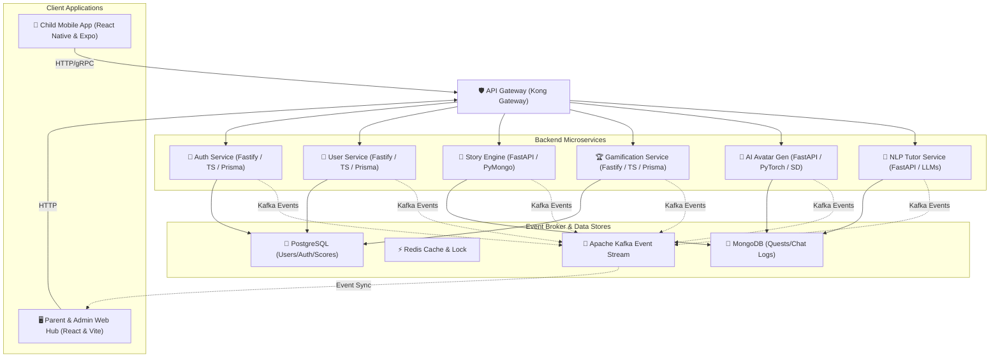

# SHUBHANU (शुभानु) ✨
### AI-Powered Story-Driven & Adaptive Gamified Learning Ecosystem for Kids (Ages 5–14)

---

## 🎓 Academic Context
* **Program**: Final Year B.Tech Project | Information Technology
* **Institution**: Pimpri Chinchwad College of Engineering (PCCOE), Pune
* **Developer**: Pranav Harad (PRN: 123B1F028)
* **Inspiration**: Built with love for my 5-year-old sister, Shubhra Harad 💖

---

## 🌟 Overview
**Shubhanu (शुभानु)**—derived from Sanskrit meaning *"auspicious light / ray of dawn"*—is a state-of-the-art, polyglot microservice ecosystem designed to revolutionize how children learn. By merging **interactive story-driven quests** with **generative AI (DreamBooth & SAM2)** and an **adaptive NLP tutor**, Shubhanu personalizes the learning journey dynamically while keeping parents connected in real-time through an event-driven administrative dashboard.

---

## 📐 Architecture & Technology Stack

Shubhanu is built as an event-driven microservices architecture using modern technologies for high availability, fault tolerance, and loose coupling.



### Key Technologies:
* **Frontend Clients**:
  * **Child App**: React Native, Expo, Zustand, React Navigation, Expo AV & Camera
  * **Parent/Developer Console**: React, Vite, Tailwind CSS, Lucide React, Canvas Confetti
* **API Gateway**: Kong Gateway (Declarative, database-less configuration)
* **Backend Microservices**:
  * **Fastify (TypeScript)**: High-performance HTTP server for `auth-service`, `user-service`, and `gamification-service` using Prisma ORM.
  * **FastAPI (Python)**: High-performance, async-first Python server for `avatar-service`, `story-service`, and `nlp-tutor-service`.
* **Deep Learning & GenAI**:
  * **Meta SAM2 + DreamBooth (Stable Diffusion)** for segmenting user photographs and training personalized avatar models.
  * **Hugging Face Transformers / PyTorch** for custom NLP tutoring.
* **Message Broker & Infrastructure**:
  * **Apache Kafka**: Used for building real-time event-driven pipelines between services (e.g., streaming XP changes, screentime events, locks).
  * **Docker Compose**: Orchestrates local datastores and development services.
  * **Terraform / AWS EKS**: Infrastructure as Code (IaC) configuration for deploying microservices onto Kubernetes.

---

## 📂 Project Structure

```
shubhanu/
├── apps/
│   ├── dashboard-web/          # React + Vite parent & developer portal
│   └── mobile/                 # React Native + Expo child app
├── services/
│   ├── auth-service/           # Fastify + TypeScript authentication logic
│   ├── user-service/           # Fastify + TypeScript user profile service
│   ├── gamification-service/   # Fastify + TypeScript rewards, XP & badges
│   ├── story-service/          # FastAPI + Python story generator & progression
│   ├── avatar-service/         # FastAPI + Stable Diffusion (DreamBooth) custom avatar pipeline
│   └── nlp-tutor-service/      # FastAPI + Python tutoring assistant
├── infrastructure/
│   ├── local-dev/              # Docker Compose for Kafka, Zookeeper, PG, Mongo, Redis
│   ├── kong/                   # Kong API Gateway config (declarative rules)
│   ├── k8s/                    # Kubernetes manifests for AWS EKS deployment
│   └── terraform/              # Terraform configurations for provisioning AWS infrastructure
└── package.json                # Main script manager
```

---

## 🛠️ Local Development & Setup

### Prerequisites
* [Node.js](https://nodejs.org/) v18+ & npm
* [Python](https://www.python.org/) v3.10+
* [Docker & Docker Compose](https://www.docker.com/)
* [Expo Go](https://expo.dev/client) app installed on your mobile device (to test the Mobile client)

### Step 1: Clone and Start Core Databases & Event Broker
Navigate to the `infrastructure/local-dev` folder and spin up the environment:
```bash
cd infrastructure/local-dev
docker-compose up -d
```
This boots:
* **PostgreSQL** on `localhost:5433` (Admin: `shubhanu_admin`, Pass: `admin_password_secure_2026`)
* **MongoDB** on `localhost:27017`
* **Redis** on `localhost:6379`
* **Apache Kafka** on `localhost:29092` & **Zookeeper** on `localhost:2181`
* **Kong API Gateway** on `localhost:8000` (Public API) and `localhost:8001` (Admin)

### Step 2: Configure Environment Files
Each service contains a `.env` template. Duplicate the template to `.env` in each service directory (e.g. `services/auth-service/.env`, `services/user-service/.env`, etc.) and adjust connection strings as needed.

### Step 3: Run the Backend Microservices

#### For Fastify (Node.js) Services (`auth-service`, `user-service`, `gamification-service`):
```bash
cd services/<service-name>
npm install
npx prisma db push  # To sync database schema
npm run dev
```

#### For FastAPI (Python) Services (`avatar-service`, `story-service`, `nlp-tutor-service`):
Create a Python virtual environment:
```bash
cd services/<service-name>
python -m venv venv
venv\Scripts\activate   # On Windows
# source venv/bin/activate  # On macOS/Linux
pip install -r requirements.txt
uvicorn app.main:app --reload --port <port>
```

### Step 4: Run the Clients

#### Start the Root Dashboard Web Portal (React + Vite):
From the root directory of the project:
```bash
npm install
npm run dev
```
Open `http://localhost:5173` to explore the **Simulated Child App View**, **Parental Control Console**, and **Kafka Event-Stream Debugger**.

#### Start the Mobile Client (React Native + Expo):
```bash
cd apps/mobile
npm install
npm run start
```
Scan the QR code displayed in the terminal with your phone using **Expo Go** (Android) or the **Camera app** (iOS).

---

## 🔒 Security & Standards
* **Authentication**: Token-based JWT authorization handled via `auth-service` and verified at the `Kong Gateway` level.
* **Child Safety**: Integrated content-filtering logic using advanced NLP algorithms within `nlp-tutor-service` and `avatar-service` to ensure user uploads and chats remain age-appropriate.
* **Microservices Isolation**: High service autonomy. Each service owns its dedicated datastore/collections and communicates strictly asynchronously via Kafka or through internal APIs.

---

